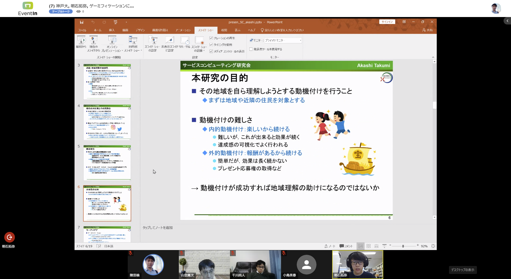
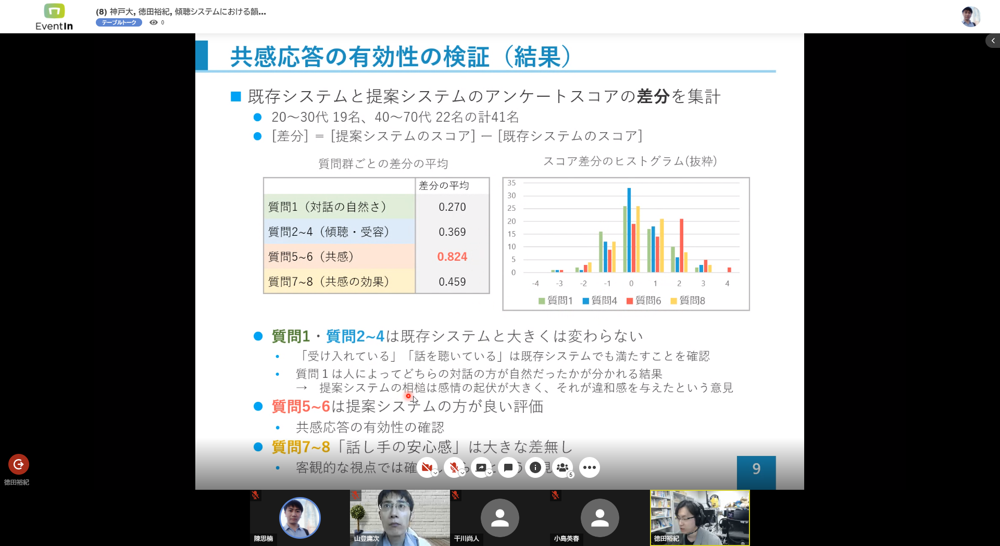
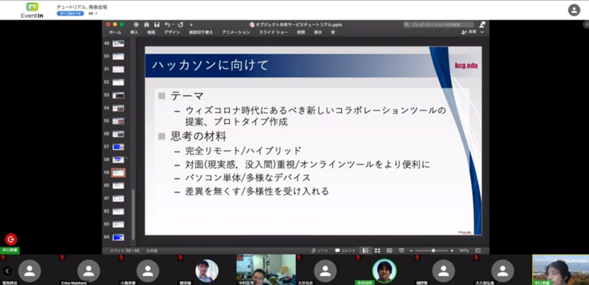
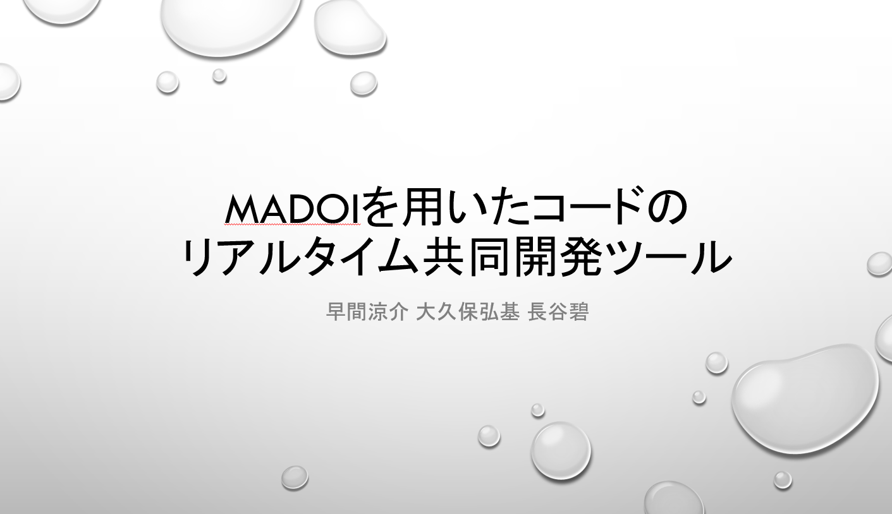
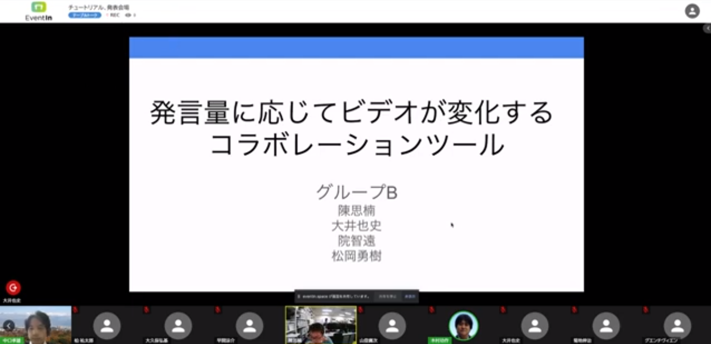
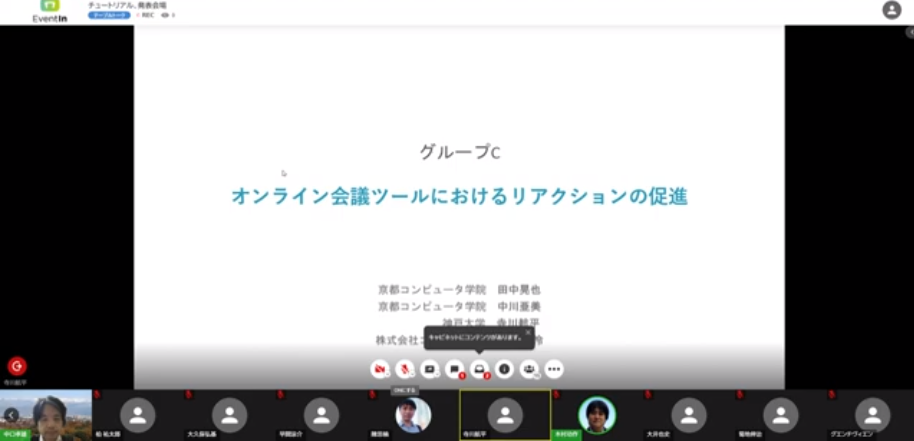
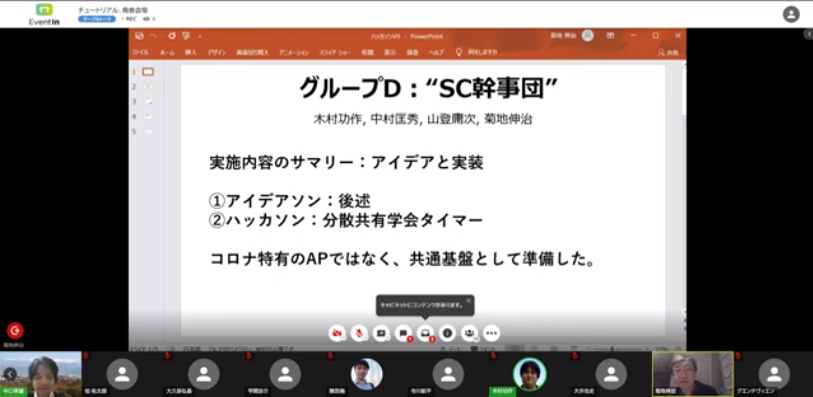
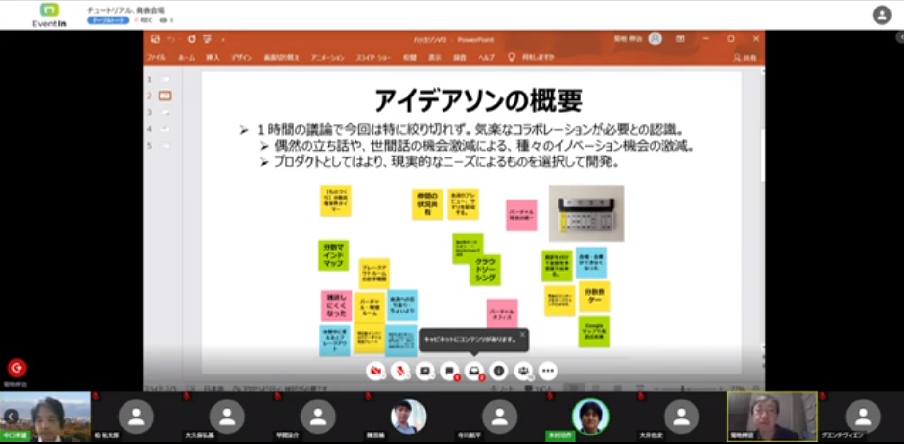

### サービスコンピューティング研究専門委員会 第39回研究会
- __テーマ:__ ソサエティ5.0に向けたサービスコンピューティングとインタプライズモデル化技術,一般
- __日程：__ 2021年11月5日（金）, 6日（土）
- __会場：__ Zoomによるオンライン 
- __共催：__ [電子情報通信学会・ソフトウェアインタプライズモデリング研究会(SWIM)](https://www.ieice.org/iss/swim/jpn/)
- __併催：__ [第20回情報科学技術フォーラム (FIT2021)](https://www.ipsj.or.jp/event/fit/fit2021/) 

- __プログラム:__

<pre>
−−−　SWIM委員長挨拶　（ 5分 ）　−−−

8月27日(金) 午前 学生セッション１ （09：35～10：50）
座長: 山登 庸次 (NTT)

(1) 09:35 - 10:00
レシートの商品特定に効果的な組み合わせ検索手法とその評価
○飯島理人・中山雅哉（東大）

(2) 10:00 - 10:25
RFC 8030とPush APIを用いたリソース単位のサーバープッシュの実現
○伊藤悠斗・真鍋義文（工学院大）

(3) 10:25 - 10:50
Combining Multiagent Reinforcement Learning and Discrete Event Modeling for Pathfinding on a Non-Grid Graph
○Shiyao Ding（Kyoto Univ.）・Hideki Aoyama（Panasonic）・Donghui Lin（Kyoto Univ.）

−−−　休憩　（ 15分 ）　−−−

8月27日(金) 午前 学生セッション２ （11：05～12：20）
座長: 林 章浩（静岡理工科大）

(4) 11:05 - 11:30
幼保施設教職員が主導する情報システム構築を目指した預かり保育業務支援システム機能拡張実験
○寺澤康大・宮田　樹・高橋　徹・山田耕嗣（阪産大）

(5) 11:30 - 11:55
気象予報を活用した熱中症救急需要の中期予測手法の検討
○中井哲也（神戸大）・佐伯幸郎（高知工科大）・中村匡秀（神戸大）

(6) 11:55 - 12:20
コンテキストに基づくサービス連携を支援するイベントルーチングサービスの検討
○中田匠哉・中村匡秀（神戸大）

−−−　休憩　（ 50分 ）　−−−

8月27日(金) 午後 一般セッション１ （13：10～14：50）
座長: 菊地 伸治 (物質・材料研究機構)

(7) 13:10 - 13:35
生産性向上のためプロセス改善活動 ～ CMMI レベル 3 達成後に継続するプロセス改善活動 ～
○林　章浩（静岡理工科大）

(8) 13:35 - 14:00
An anomaly detection method to reduce the effect of concept drift
○Jaiswal Satish Kumar・Masuda Mineyoshi（Hitachi）

(9) 14:00 - 14:25
ライダモニタリングによる二輪車安全向上システムの構想
○杉野貴美廣・佐藤洋一郎・有本和民（岡山県大）

(10) 14:25 - 14:50
Kafka StreamsとGitOpsによる継続的な連携を考慮したデータ連携基盤の提案
○鳥山陽平・北島信哉・高橋　潤・山下一寛・佐々木裕介・野間　唯（富士通）

−−−　休憩　（ 15分 ）　−−−

8月27日(金) 午後 一般セッション２ （15：05～16：30）
座長: 調整中（SWIM担当）

(11) 15:05 - 15:30
分散共有機能のサービス化に向けたプログラミングモデルの設計と実装
○中口孝雄（京都情報大）

(12) 15:30 - 15:55
プロトタイプ構築法を基にした分野別応用アイディア創出のIoT教育法の提案と実践評価
○秋山康智（アイテック阪急阪神）・石原正仁（こども教育宝仙大）・大江信宏（サイバー大）・井上雅裕（慶大）・小泉寿男（M2M研究会）

(13) 15:55 - 16:20
ヘテロデバイス自動オフロード時の電力使用量削減評価
○山登庸次（NTT）

−−−　SC委員長挨拶・次回研究会案内　（ 10分 ）　−−−
</pre>

### 実施報告

(2022-03-08 中村)

SC研究会・幹事の中村＠神戸大学です．今回も報告が数か月も遅れてしまいました．誠に申し訳ありません．

第40回研究会研究会は，2021年11月5日, 6日の2日間にわたり，[KBSE研究会](https://www.ieice.org/iss/kbse/)との共同開催で行いました．もともとは，2020年11月に出来なかった現地での共同開催を計画していたのですが，コロナ禍再拡大の状況を鑑みて，__連邦制__ 研究会という新しい開催法を試しました．これは，それぞれの研究会の独自の開催色を出しながらも，緩く連携して互いの研究会に積極的に参加しようという新しい試みです．

今回，SC研究会は研究会2日目にEvent-Inによるオンライン開催を行うということになりました．そこで新しい試みとして，研究会をコラボレーションの「場」とすべく，__オンライン・ハッカソン__ を実施しました．

Event-Inの機能をフル活用し，まず一般の発表はポスター形式にして時間を効率的に圧縮しました．続けて，京都情報大学院大学の[中口孝雄先生](https://www.kcg.edu/faculty/associate-professor/t-nakaguchi)を講師に迎え，madoiという分散共有オブジェクトのフレームワークのチュートリアルをしていただきました．最後に，参加者がEvent-Inのテーブルに分かれ，madoiを活用した __With/Afterコロナ時代のアプリケーション__ を考案・開発するハッカソンを行いました．

アイスブレイク，アイデア出し，開発，発表まで，4時間という短い時間ながらも，Google JamboardやVS-Codeを使った共同コーディングなど，オンラインならではのコラボレーションが行われました．

その結果，下記の成果物が発表されました．
- グループA : MADOIを用いたコードのリアルタイム共同開発ツール
- グループB : 発言量に応じてビデオが変化するコラボレーションツール
- グループC : オンライン会議ツールにおけるリアクションの促進
- グループD ハッカソン : 分散共有学会タイマー

投票の結果，グループBの作品が，優秀賞を受賞しました．

新型コロナウィルスの感染拡大は依然として収まらず，今回もオンラインになりました．
しかしながら，このような状況の中でも，ハッカソンという新しい試みを行い，成功裏に終わったことは大変良かったです．発表者の皆様，講師の中口先生，アシスタントをいただいた学生さん，参加者の皆様に感謝の意を表したいと思います．

なお，今回のSC研究会の報告は，電子情報通信学会のソサイエティ紙でも発表される予定です．
お楽しみに．

### ポスター発表の様子 (一部)
 
神戸大・明石君の発表，「ゲーミフィケーションに基づく地域理解動機付けのためのクイズラリープラットフォームの試作」

神戸大・徳田君の発表．「傾聴システムにおける韻律特徴を活用した非言語的な共感応答の開発」

### チュートリアル

京都情報大学院大学・中口先生によるmadoiのチュートリアル

### ハッカソンの成果物

グループA : MADOIを用いたコードのリアルタイム共同開発ツール

グループB : 発言量に応じてビデオが変化するコラボレーションツール

グループC : オンライン会議ツールにおけるリアクションの促進

グループD ハッカソン : 分散共有学会タイマー

グループD Jamboardを使ったアイデアソンの紹介

### 次回の予定

次回の[第41回研究会](https://www.ieice.org/ken/program/index.php?tgs_regid=92dbe9bdb342696d9d44dc58efc144c9f812c01ccb10a77c7144474816db6873&tgid=IEICE-SC)は2022年3月11日(金)の予定です．

みなさまのご参加，お待ちしております．

