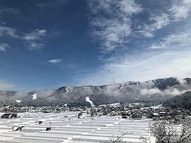
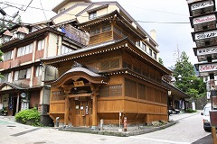
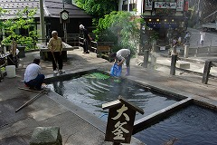
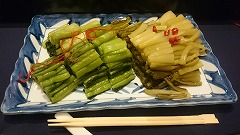

## 野沢温泉村 as バーチャル開催地 of 2020年11月 SC研究会/KBSE研究会

(画像出典： Wikipedia)

2020年11月13日(金)，14日(土)に行われる第36回SC研究会（共催：KBSE研究会）では，当初開催を予定しておりました __野沢温泉村__ を __バーチャル開催地（Virtual Venue，VV）__ に設定し，研究会を実施します．

### ご当地名物で乾杯しましょう！

この度，野沢温泉　[ホテル　ハウスサンアントン様](https://www.st-anton.jp/?lang=ja) にご協力いただき，
__「オンライン懇親会のための、信州・野沢温泉の特産品」__ を今回のKBSE/SC研究会のために特別にご用意いただきました．

- [お取り寄せ注文ページへ](http://st-anton.shop/?pid=154860912)
    - 注文・決済はご自身でお願いいたします
    - オンライン懇親会の参加において，上記商品の購入を強制するものではありません

珍しい野沢温泉村の食べ物に触れ，さらには地元経済を応援するチャンスです．皆様のご理解とご協力をお願いいたします．

※VVの詳細については，以下をご覧ください．

## ヴァーチャル開催地 (Virtual Venue, VV) とは

### 学会発表における開催地の魅力

これまで学会や研究会は全国の様々な都市で開催され， __「ご当地を訪ねて発表する」__ ことは研究発表の大きな魅力の一つでした．
しかしながら，新型コロナウィルス感染拡大の影響で，信学会の研究会は中止，あるいは，オンライン開催を余儀なくされています．

こうした状況の中，学会員はご当地を巡ることが物理的にかなわず，学会活動のモチベーション半減にもつながっていると考えています．信学会事務局の調べでは，これまで研究会の2割の開催が中止，研究会参加者数は例年比で約40%ダウンしているということです．

さらには，当初予定されていた会場のキャンセルは， __ご当地の経済にも大きな影響__ を与えています．学会・研究会として何かできることはないのでしょうか？

### バーチャル開催地のねらい

SC研究会にて考え出された __バーチャル開催地 (Virtual Venue, VV)__ とは，研究会ごとに仮想的な開催地を設定し，オンラインでありながらも __ご当地に行った気分になるような研究会__ を実施することです．具体的な施策としては，

- 各回の研究会で，仮想的な開催地を設定し，ご当地の情報や見どころ等を紹介する時間を設ける
    - 開催地の選定は，幹事団や専門委員の推薦，または，研究会コミュニティからの希望等に基づく
    
- ご当地の名物やお酒を取り寄せ，オンライン懇親会でいただき会話の話題作りにする
    - ご当地名物は幹事団で調査し，Webページなどで紹介する．場合によっては，幹事団が現地の業者と交渉し，リーズナブルで調達しやすい形を模索する
    - 注文・支払いは __希望者が各自自費__ で行う．ただし，オンライン懇親会の参加にあたって，購入を強制するものではない．

実際に現地に行く場合とは比べられませんが，少なくとも何もしないよりは開催地の魅力に触れられるのではないでしょうか？
また何よりも，コロナ禍で打撃を受けている __ご当地の経済を応援__ する事もできます．

コミュニティの皆様におかれましては，バーチャル開催地の趣旨をご理解いただき，研究会への積極的なご参加をよろしくお願いいたします．

